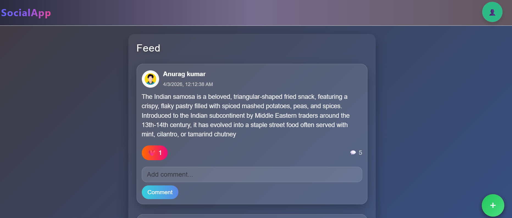
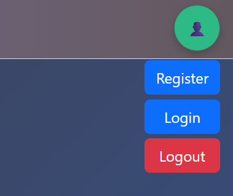

# SocialApp 🚀
[Live Demo](https://social-app-gamma-seven.vercel.app/) 🌐
[](https://reactjs.org/) 
[](https://nodejs.org/) 
[](https://expressjs.com/)  

A simple social application built with **React** (frontend) and **Node.js/Express** (backend) that allows users to register, login, create posts, like, comment, and logout.

---

## 🔹 Features

- ✅ User registration and login  
- ✅ Create, view, and delete posts  
- ✅ Comment and like posts  
- ✅ Logout functionality  
- ✅ Responsive navbar with toggleable user menu  
- ✅ Floating "Create Post" button  

---

## 🔹 Folder Structure


social/
├─ frontend/ # React frontend
│ ├─ src/
│ │ ├─ components/ # React components (Navbar, Post, etc.)
│ │ ├─ api/ # Axios API configuration
│ │ └─ App.jsx # Main React app
├─ backend/ # Node.js/Express backend
│ ├─ routes/ # API routes
│ ├─ controllers/ # Controller logic
│ └─ server.js # Entry point
├─ .gitignore
├─ README.md


---

## 🔹 Installation

### Frontend

```bash
cd frontend
npm install
npm start
Backend
cd backend
npm install
npm run dev

Make sure Node.js and npm are installed.

🔹 Usage
Open the frontend at http://localhost:3000
Register a new user or login
Use the floating + button to create a post
Hover or click the avatar to register, login, or logout
Interact with posts by commenting or liking
🔹 How the Code Works
Navbar: A toggleable avatar menu that shows Register, Login, Logout buttons on hover or click.
API: All backend requests are made using Axios (frontend/src/api/axios.js).
Authentication: JWT stored in cookies with proper SameSite and Secure settings for local and production.
State Management: React useState and useEffect handle UI updates dynamically.
Routing: React Router manages navigation between pages (/login, /register, /create, /).
Backend: Express routes handle posts, comments, authentication, and logout logic.
🔹 Screenshots


Homepage

Create Post

Navbar Menu

🔹 Technologies Used
Frontend: React, Axios, React Router, Bootstrap
Backend: Node.js, Express, JWT, MongoDB (if used)
Other: CSS, HTML, Git